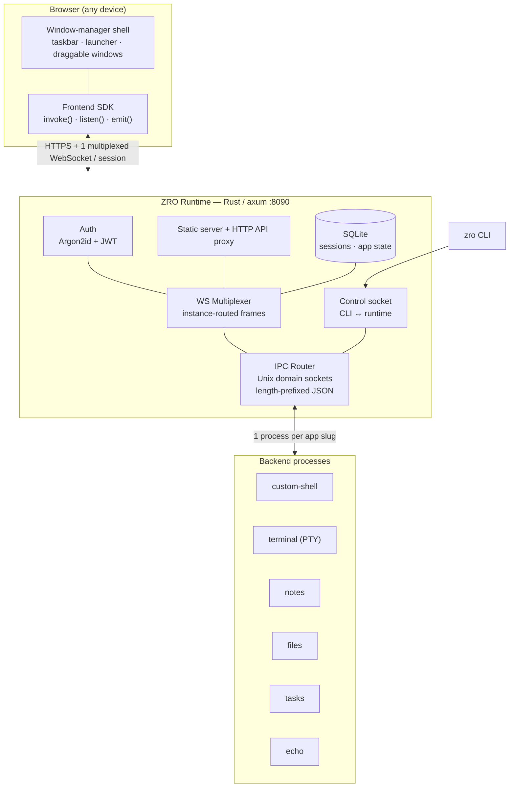
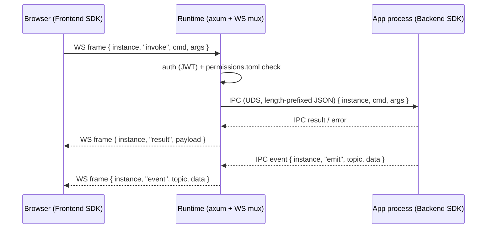

# ZRO

**A structured remote-desktop environment for Linux — in the browser.**

A single Rust runtime turns a Linux server into a full desktop accessible from any web
browser. Each application runs as an **isolated backend process**; the runtime renders
them in a **window-manager shell** and multiplexes everything over **one WebSocket per
session**. Think "RDP for the web", but where every app is a tiny program talking a
Tauri-style command/event API.

<!-- TODO: add a screenshot / GIF of the desktop shell here -->
<!--  -->

[](runtime/)
[](sdks/)
[]()
[](LICENSE)

---

## Why

Running GUI apps on a remote Linux box usually means X11 forwarding, VNC, or a full RDP
stack — heavy, stateless, and awkward through a browser. ZRO takes a different angle:
the "desktop" is a web page, the "apps" are isolated processes, and the contract between
them is a small, well-defined IPC protocol. The result is a system that is **scriptable**
(an app is ~100 lines with the SDK), **multi-tenant** (role-based permissions per app),
and **session-persistent** (close the tab, come back, your windows are where you left them).

## Architecture



**Key design decisions**

- **One backend per app *slug*, not per window** — multiple windows of "Notes" share a
  single `notes` process; each window is an *instance* with its own ID.
- **One WebSocket per session** — all app traffic is multiplexed and instance-routed over
  a single connection; no socket-per-window fan-out.
- **The shell is just an app** — the desktop/window-manager (`custom-shell`) uses the same
  SDK and IPC as every other app; nothing about it is privileged in the protocol.
- **Tauri-inspired SDK** — backends register `.command("name", handler)`; the frontend
  calls `invoke("name", args)` and subscribes with `listen()` / `emit()`. HTTP routes are
  auto-routed through the runtime's API proxy.
- **systemd-native** — `Type=notify`, watchdog, `SIGHUP` reload, journald logging.

### Request / frame flow



## Quick start

```bash
# Local development — builds everything, starts the runtime on http://localhost:8090
./run.sh
# default login: dev / dev

# Production (systemd)
sudo ./scripts/install.sh
sudo systemctl enable --now zro-runtime
zro --help          # manage apps, users, config against a live runtime
```

## Features

| Feature | Description |
|---|---|
| **Tauri-style backend SDK** | `.command("name", handler)` — define commands, the SDK handles IPC framing |
| **Frontend SDK** | `invoke()` / `listen()` / `emit()` — call the backend and stream events from JS |
| **Multi-language backends** | SDKs for **Rust**, **Python**, **Node.js** |
| **Window manager** | Desktop shell with draggable windows, taskbar, launcher |
| **Session persistence** | Close the browser → reopen → your apps are exactly where you left them |
| **Multi-instance** | Several windows per app, each with a unique instance ID |
| **Shell API** | Apps control their own window: title, badge, notifications, focus |
| **Permissions** | Role-based access per app via `permissions.toml` |
| **`zro` CLI** | Install / update / remove apps, manage users and config |
| **systemd native** | `Type=notify`, watchdog, `SIGHUP` reload, journald logs |

## Built-in apps

| App | Description | Roles |
|---|---|---|
| **custom-shell** | Desktop WM with taskbar & launcher | all |
| **terminal** | Full PTY terminal (per-window shell) | admin |
| **notes** | Markdown editor | admin, user |
| **files** | File browser | admin, user |
| **tasks** | Task manager | admin, user |
| **echo** | Reference app exercising every SDK feature | admin, user |

## Repository layout

```text
runtime/   Rust/axum runtime: auth, WS multiplexer, IPC router, static server
protocol/  zro-protocol crate: wire types shared by runtime ↔ apps ↔ SDKs
sdks/      Backend SDKs (rust, python, nodejs) + the frontend JS SDK
apps/      The built-in apps (custom-shell, terminal, notes, files, tasks, echo)
cli/       The `zro` command-line tool
config/    runtime.toml · users.toml · permissions.toml
system/    systemd unit + install assets
docs/      Architecture, IPC protocol, SDK references, app guide, deployment
```

## Documentation

| Doc | Contents |
|---|---|
| [docs/architecture.md](docs/architecture.md) | Full architecture, IPC protocol, auth, gateway, storage |
| [docs/backend-sdk.md](docs/backend-sdk.md) | Rust / Python / Node.js reference, modules, HTTP auto-routing |
| [docs/frontend-sdk.md](docs/frontend-sdk.md) | `ZroClient`, the 20 frontend modules (transport, state, shell, …) |
| [docs/app-guide.md](docs/app-guide.md) | Building an app: manifest, patterns, reference of the 7 apps |
| [docs/configuration.md](docs/configuration.md) | `runtime.toml`, `users.toml`, `permissions.toml` |
| [docs/deployment.md](docs/deployment.md) | systemd service, CLI, production, reverse proxy |

## Testing

```bash
cargo test -p zro-protocol                      # protocol tests
cd sdks/python && python -m pytest tests/ -v    # Python SDK tests
cd sdks/nodejs && npm test                      # Node.js SDK tests
./test_e2e.sh                                   # end-to-end tests
```

## Status

Active. Single-binary runtime; production install via systemd. See `todo.md` for the
current backlog.

## License

[MIT](LICENSE)

---

<sub>Part of my work — more at <a href="https://zz0r0.fr">zz0r0.fr</a>.</sub>
